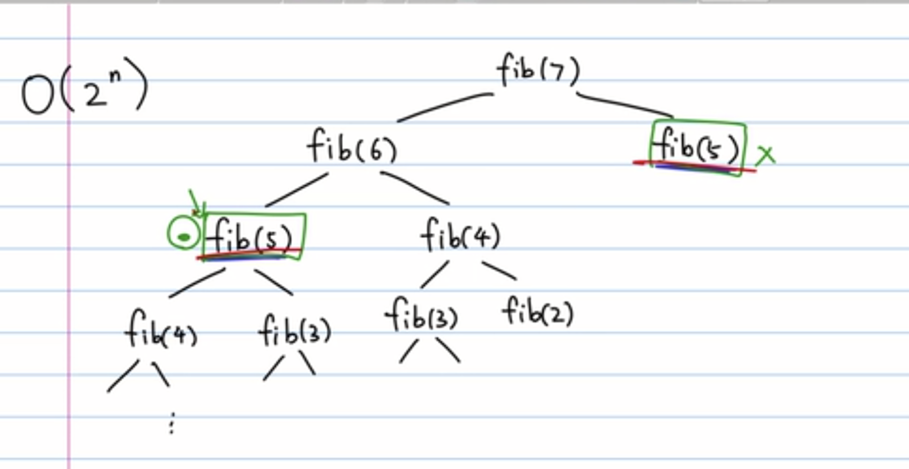
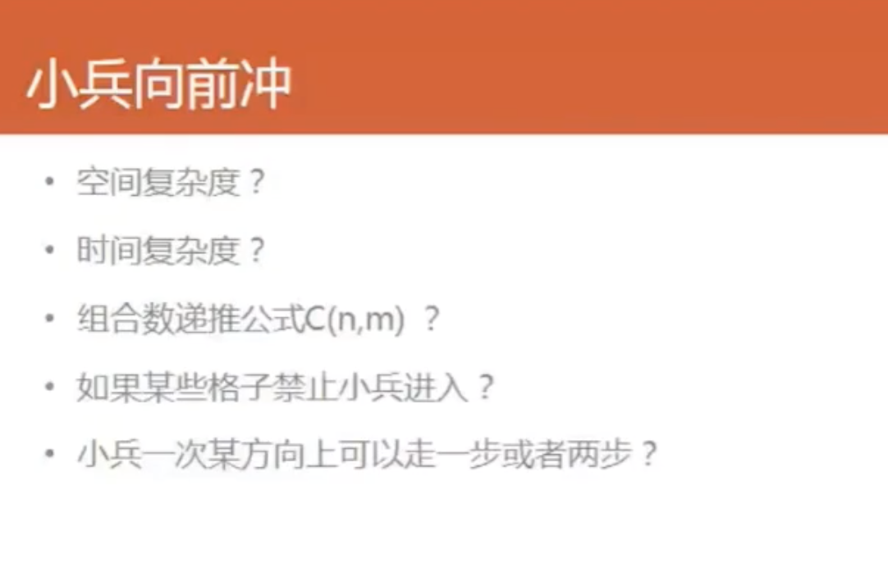
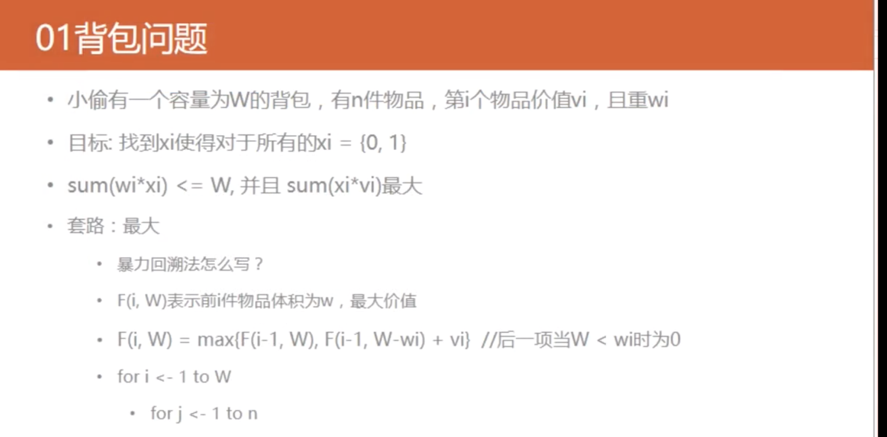

## Dynamic programming 

Fibonachi Sequence 

1 1 2 3 5 8 13 21

fib(n) = 1  n = 1 or 2

else 

fib(n) = fib(n-1) + fib(n-2)

overlap sub-problem



```cpp
int fib(int n) {
    if(n <= 1) {
        return 1;
    }
    return fib(n-1) + fib(n-2);
}
```

```cpp
// 递推
f[0] = 1;
f[1] = 1;
for(int i = 2; i < n; i++) {
    f[i] = f[i-1] + f[i-2];
}
```

如果递归展开的话我们需要重新计算fib(5),复杂度为O(2^N),我们要想办法去利用之前的值


```cpp
int fib(int n) {
    if(n <= 1) {
        return 1;
    }
    if(result[n] >= 0) {
        return result[n];
    }
    return fib(n-1) + fib(n-2);
}
```

如此overlap sub-problem子问题就变成了O(N)的复杂度


## 198. House Robber 01 暴搜

暴力搜索一定是递归，这题用暴搜超时，但是体现了上述过程的思想，比较当前值+prev的递归和上一个值的递归，这样我们问题规模就越变越小了，虽然这道题超时，但是思路值得借鉴。

时间复杂度分析，因为最多可能要N次，每次有2种决策，所以O(2^N)

我们来分析优化：

n-1 -> (n-3, n-4, n-5 ....)

n-2 -> (n-4, n-5 .....)

其中有很多重复计算

我们希望if(算过) return 结果


QA:c++类成员变量初始化(unsolved)

https://zhuanlan.zhihu.com/p/118692769

## 198. House Robber 02 dp

根据我们上面分析，我们用一个数组存储已经算过的值就可了

因为每一个状态我们只用算一遍，我们的时间复杂度为O(N),空间复杂度为O(N)


## 198. House Robber 03 dp 迭代

将上面这个自顶向下的递归改为自底向上的迭代，这样边界判断和前面数字处理会多一点，但逻辑会更加清晰。

## 198. House Robber 04 dp 迭代 滚动数组

其实我们这里只需要前两次的房屋就可了，所以我们只需要两个变量来存就可

## 小兵向前冲




```cpp
// 暴力回溯
int f(int m, int n) {
    if(m == 0 || n == 0) return 0;
    if(m == 1 || n == 1) return 1;
    return f(m-1, n) + f(m, n-1);
}
```

## 64. Minimum Path Sum 01 dp

Input:
[
  [1,3,1],
  [1,5,1],
  [4,2,1]
]

之前棋盘看多了，下意识左下是(0,0)了，这个是个很典型的dp问题，暴力的话，时间复杂度为O(2^N),我们这里状态转移方程为f(m,n) = min(f(m-1,n),f(m,n-1))+ grid(m,n).因为我们这里比较做小，边界条件超过的话就返回INT_MAX。时间复杂度是O(MN)，空面复杂度为O(MN)。

## 64. Minimum Path Sum 02 暴力

暴力超时，主要是可以得到状态转移方程，我们这里的时间复杂度为O(2^(M+N)),空间复杂度为O(M+N),因为递归的深度为M+N

## 64. Minimum Path Sum 03 二维dp 递推

这里我们建立一个二维的dp数组递推装最小的sum，我们先把最边缘的两边[0][j]和[i][0]给一路加上值，其他的是min(dp[i-1][j], dp[i][j-1]) + grid[i][j].这个是自底向上的递推。空间复杂度为O(M*N),时间复杂度为O(M*N)

## 64. Minimum Path Sum 03 递推，无需额外空间

因为这个只用遍历一次二维数组，所以我们不需要额外空间。

空间复杂度为O(1),时间复杂度为O(M*N)

## 01背包问题



```cpp
// 暴力法
int w[n], v[n], W;

// S <= W
int search(int idx, int S) {
    if(S > W) return 0;
    if(idx >= 0) return 0;
    return max(search(idx + 1, S+ w[idx]) + v[idx], search(idx + 1, S));
}
```

```cpp
int w[n], v[n], W;

int search(int idx, int S) {
    if(S > W) return 0;
    if(idx >= 0) return 0;
    if(f[idx][S] >= 0) return f[idx][S];
    f[idx][S] = max(search(idx + 1, S+ w[idx]) + v[idx], search(idx + 1, S));
    return f[idx][S];
}
```

```cpp
// 递推
f[0][0] = 0;
for(int i = 1; i <= W; ++i){
    f[0][i] = -maxValue;
}
for(int idx = 1; i <= n; ++idx) {
    f[idx][0] = 0;
    for(int j = 1; j <= W; ++j) {
        f[idx][j] = f[idx -1][j];
        if(j >= w[idx]) 
            f[idx][j] = max(f[idx-1][j - w[idx]] + v[idx], f[idx][j]);
    }
}
```

## 322. Coin Change 01 暴力

这里我们的状态就是两个，一种是选择search(idx, amount-coins[idx], coins)+1，一种是不选择search(idx-1, amount, coins)，直接进行到下一种面值不增加。

时间复杂度为O(2^(K*N))

## 322. Coin Change 02 dp 开二维数组备忘录

这里有点蠢，但是没得办法，这种暴力是有两种状态决定的，一种是amount，一种是面值，开了个 N* K大小的数组，因为N可能很大，这里时间复杂度就降为了O(N*K),空间复杂度为O(K*N)，但是这种的overlap问题也不是很好的解决，因为10分为了10(1),10(2),10(5).

## 322. Coin Change 03 另一种暴力

时间复杂度分析: 子问题总数 * 解决每个子问题的时间

这个多叉树的结点有(N^K)，相当于每一个都遍历一下，每一个子问题带有一个循环，所以时间复杂度为O(K*N^K)

## 322. Coin Change 04 上个暴力的dp

因为这里就一个变化量amount，所以我们开一个一维数组存mount状态，我们这里的时间复杂度为O(K*N)，空间复杂度为O(N)

## 322. Coin Change 05 递推1

应用DP框架：

```
# 初始化 base case
dp[0][0][...] = base
# 进行状态转移
for 状态1 in 状态1的所有取值：
    for 状态2 in 状态2的所有取值：
        for ...
            dp[状态1][状态2][...] = 求最值(选择1，选择2...)
```

时间复杂度为O(K*N)，空间复杂度为(N)


## 746. Min Cost Climbing Stairs 01 暴力

肯定不能过，只是第一步找出暴力搜索，然后去优化

## 746. Min Cost Climbing Stairs 02 dp 递归

和其他dp一样，我们这里需要都遍历一次，时间复杂度为O(N),空间复杂度为O(N)。

这里我们遇到一个问题就是，我们最后一个是走还是不走，我们精妙的添加一个0，如果不走的话我们选到下一个阶梯就为0即可。

状态转移方程也是把大问题拆成小问题，将最小的前面方案加上当前。

## 746. Min Cost Climbing Stairs 03 递推

学会将递归改为递推，即自顶向下改为自底向上，()改为[]，边界条件。

时间复杂度，空间复杂度皆为O(N)

## 746. Min Cost Climbing Stairs 04 递推 滚动数组

只需要i-2 i-1即可，滑动过去，所以空间复杂度减为O(1)

# 线性DP 

线性 DP 问题是指递推方程具有明显的线性关系，有一维线性和二维线性。

https://www.cnblogs.com/grandyang/p/4938187.html

## 300. Longest Increasing Subsequence 01 dp

用一个dp数组存每个位置的串长最大值，第二重复循环走前面的值，如果小的话，就把最大长度和当前所存的长度比较，如果大就存下来，每次第二重循环走完后都要比较下当前是否为整个的最长。

空间复杂度为O(N),时间复杂度为O(N^2)

## 1143. Longest Common Subsequence 01 暴力搜索

一种有三种情况，第一种是匹配到，然后就继续同时往下走，还有一种是没有匹配赛，要么text1走，要么text2走。

注意边界条件为何x == -1 || y == -1 即可。

那么时间复杂度最坏为O(2^(M+N))

一个问题

```cpp
if str1[i - 1] == str2[j - 1]:
    # ...
else:
    dp(i,j) = max(dp(i-1,j), 
                   dp(i,j-1),
                   dp(i-1,j-1))
```

不需要这样是为何，因为在dp(i-1,j-1)是最小的那个


## 1143. Longest Common Subsequence 02 dp 迭代

很明显他有两个状态，所以我们用一个二维memo来存储状态即可。

时间复杂度为O(M*N),空间复杂度为O(M*N)

## 1143. Longest Common Subsequence 03 dp 递推

还是应用框架即可。

时间复杂度为O(M*N),空间复杂度为O(M*N)

## 1143. Longest Common Subsequence 04 dp memory optimization

You may notice that we are only looking one row up in the solution above. So, we just need to store two rows.

time complexity O(M*N)

space complexity O(N)

## 1143. Longest Common Subsequence 05 dp memory optimization

我们开的空间在于第二重循环，所以我们将小的放进二重循环中。

time complexity O(M*N)

space complexity O(min{M,N})

## 1035. Uncrossed Lines 01 dp 递归 02 递推 03 内存优化

和1143完全一样，不相交，又要对应。本质就是最长子序列。

## 583. Delete Operation for Two Strings

这道题要求最少改变，其实就是减去最大子序列，求同存异，所以和1143一样。

## 516. Longest Palindromic Subsequence 01 dp

这道题也和最长子序列相同，我们就是求他和自身的逆序的最长子序列，就是最长的回文子序列。

时间复杂度为O(N*N)

空间复杂度为O(N)

##  

## 1092. Shortest Common Supersequence


## 96. Unique Binary Search Trees 01 dp recursion

Taking 1~n as root respectively:

    1 as root: # of trees = F(0) * F(n-1)  // F(0) == 1

    2 as root: # of trees = F(1) * F(n-2) 

    3 as root: # of trees = F(2) * F(n-3)

    ...
    
    n-1 as root: # of trees = F(n-2) * F(1)
    
    n as root:   # of trees = F(n-1) * F(0)
 
    So, the formulation is:
    
    F(n) = F(0) * F(n-1) + F(1) * F(n-2) + F(2) * F(n-3) + ... + F(n-2) * F(1) + F(n-1) * F(0)


State transition equation：

for(int i = 1; i <= n; i++) {
    memo[n] += helper(i - 1) * helper(n - i);
}

TC : O(N^2)

Because 1 + 2 + 3 + ... + n = O(n^2)

SC : O(N)

## 96. Unique Binary Search Trees 02 dp iteration 

moban

TC : O(N^2)

SC : O(N)

## 122. Best Time to Buy and Sell Stock II 01


