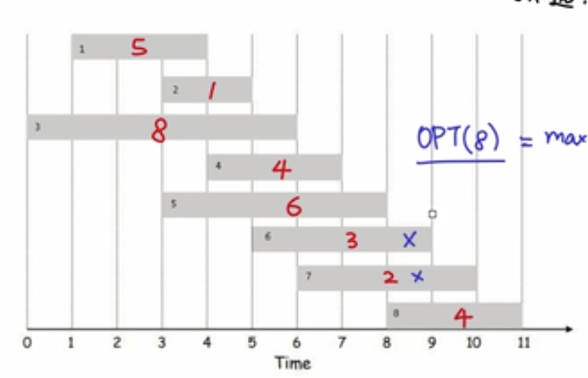

## Dynamic programming 

Fibonachi Sequence 

1 1 2 3 5 8 13 21

fib(n) = 1  n = 1 or 2

else 

fib(n) = fib(n-1) + fib(n-2)

overlap sub-problem

如果递归展开的话我们需要重新计算fib(5),复杂度为O(2^N),我们要想办法去利用之前的值

如此overlap sub-problem子问题就变成了O(N)的复杂度

