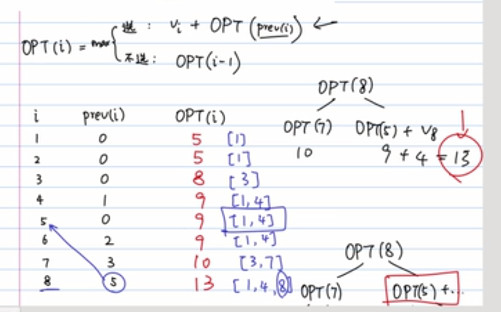

## Dynamic programming 

Fibonachi Sequence 

1 1 2 3 5 8 13 21

fib(n) = 1  n = 1 or 2

else 

fib(n) = fib(n-1) + fib(n-2)

overlap sub-problem


```cpp
int fib(int n) {
    if(n <= 1) {
        return 1;
    }
    return fib(n-1) + fib(n-2);
}
```

```cpp
// 递推
f[0] = 1;
f[1] = 1;
for(int i = 2; i < n; i++) {
    f[i] = f[i-1] + f[i-2];
}
```

如果递归展开的话我们需要重新计算fib(5),复杂度为O(2^N),我们要想办法去利用之前的值


```cpp
int fib(int n) {
    if(n <= 1) {
        return 1;
    }
    if(result[n] >= 0) {
        return result[n];
    }
    return fib(n-1) + fib(n-2);
}
```

如此overlap sub-problem子问题就变成了O(N)的复杂度




## 198. House Robber 01 暴搜

暴力搜索一定是递归，这题用暴搜超时，但是体现了上述过程的思想，比较当前值+prev的递归和上一个值的递归，这样我们问题规模就越变越小了，虽然这道题超时，但是思路值得借鉴。

时间复杂度分析，因为最多可能要N次，每次有2种决策，所以O(2^N)

我们来分析优化：

n-1 -> (n-3, n-4, n-5 ....)

n-2 -> (n-4, n-5 .....)

其中有很多重复计算

我们希望if(算过) return 结果


QA:c++类成员变量初始化(unsolved)

https://zhuanlan.zhihu.com/p/118692769

## 198. House Robber 02 dp

根据我们上面分析，我们用一个数组存储已经算过的值就可了

因为每一个状态我们只用算一遍，我们的时间复杂度为O(N),空间复杂度为O(N)


## 198. House Robber 03 dp 迭代

将上面这个自顶向下的递归改为自底向上的迭代，这样边界判断和前面数字处理会多一点，但逻辑会更加清晰。

## 198. House Robber 04 dp 迭代 滚动数组

其实我们这里只需要前两次的房屋就可了，所以我们只需要两个变量来存就可

## 小兵向前冲


```cpp
// 暴力回溯
int f(int m, int n) {
    if(m == 0 || n == 0) return 0;
    if(m == 1 || n == 1) return 1;
    return f(m-1, n) + f(m, n-1);
}
```

## 64. Minimum Path Sum 01 dp


